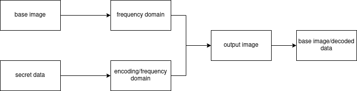
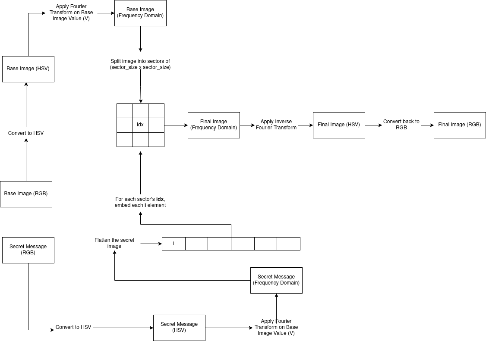
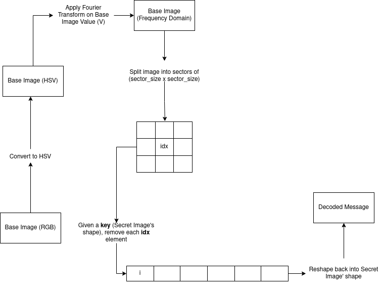
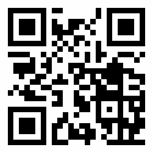

# Frequency domain based image steganography

## Students

- Fabiana Dalacqua Mendes
- Lucas Yamamoto
- Pedro Henrique Nieuwenhoff

## Objective

The goal of this project is to use image processing techniques to hide discretely data inside a given digital image. There are various methods to achieve this goal. The one used is a frequency domain based method, the Fourier Transform, which transforms the input images into a frequency domain and merge them, creating an output image.

This output image will appear to be just the regular input image, but we can recover the information we put in before by decoding, using a similar method.

Simplified diagram showing how the encoding method works

### Why use frequency domain?

When we search about steganography in images, most of the easy access code examples use the LSB method. The LSB (initials of Least Significant Bit) is a popular technique that replaces the N least-significant bits of each pixel of an image with the message to be hidden, taking advantage of the way human eye can perceive images. This method hides the data in the spatial domain and have a simple implementation, but also have some disadvantages:

- The image degrades as the N (the number of least-significant bits replaced) increases;
- Is easy for a steganalyst to suspect and identify (using histogram analysis, per example) that the image have an hidden message.

Trying to avoid such problems, we can use a technique that hide data in **frequency domain** which is just as computationally viable as spatial domain work.

Basically, frequency domain represents the rate of change of spatial pixels. This domain allow you to have control over the whole image, where is possible to enhance and suppress different characteristics in a easy way, also has an established set of processes and tools that can be borrowed directly from signal processing in other domains. Furthermore, tools such as correlation and convolution become much simpler and computationally cheaper when performed in the frequency domain.

I this project, we use a sampled Fourier Transform, the **Discrete Fourier Transform** and therefore does not contain all frequencies forming an image, but only a set of samples which is large enough to fully describe the spatial domain image. Also, the needed routines for DFT are avaiable in Python NumPy [library](https://numpy.org/doc/stable/reference/routines.fft.html).

## Code and images sources

- Source code can be found in steg.ipynb file in this repository.
- Input image used as example was downloaded [here](https://wallpapercave.com/w/wp2754860).
- The input QR Code was generated using [something](http://google.com).

## Example and how it works

The images used int this example were a Windows XP classic wallpaper jpg image of 1920x1080px as the base and a random QR Code png image of 195x195px as our secret message.

We first convert the base image to HSV, then apply the Fourier Transform on the resulting image, as well as the secret image. With the frequency domain at hands, we divide the base image into sectors (3x3 matrices in this case) then embed each frequency of the secret message on the sector's central frequency. After that, we convert it back to RGB format and the result is our output image, as you can see below.

---

### Encoding

Detailed diagram of encoding method

**Example**

**Input Images**

  
  

**Final Image**

---

### Decoding

If we have a key value (the secret image's dimensions), we can recover each frequency we've put in on the encoding stage. With those frequencies, we simply apply the Inverse Fourier Transform to get back the original secret message.

Detailed diagram of decoding method

**Example**

**Decoded Message**

---