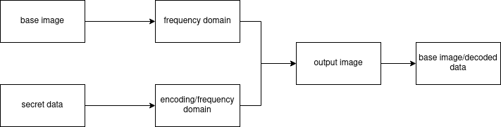

# Frequency domain based image steganography
## Students
* Fabiana Dalacqua
* Lucas Yamamoto
* Pedro Henrique Nieuwenhoff

## Objective
The goal of this project is to use image processing techniques to hide discreetly data inside a given digital image.
There are various methods to achieve this goal. The one used is a frequency domain based (Fourier Transform)
method, which transforms the input images into a frequency domain and merge them, creating an output image.  

This output image will appear to be just the regular input image, but we can recover the information we put in before by decoding,
using a similar method.

### Example and how it works
The images used here were the ones below: a 1920x1080 .jpg base image of the Windows XP classic wallpaper and a 195x195 .png random QR Code as our secret message.
We first convert the base image to HSV, then apply the Fourier Transform on the resulting image as well as the secret image. 
With the frequency domain at hands, we divide the base image into sectors (3x3 in this case) then embed each frequency of the secret message on the sector's central frequency. After we convert it back to RGB format, the result is our output image, as you can see below.

### Input Images

  
  

  
### Output Image

  

  
  If we have a key value (the secret image's dimensions), we can recover each frequency we've put in on the encoding stage. With those frequencies, we simply apply the Inverse Fourier Transform to get back the original secret message.
  
  ### Conclusion
  All the code can be found in the steg.ipynb file.
  
  ### Links
  input image link: https://wallpapercave.com/w/wp2754860
